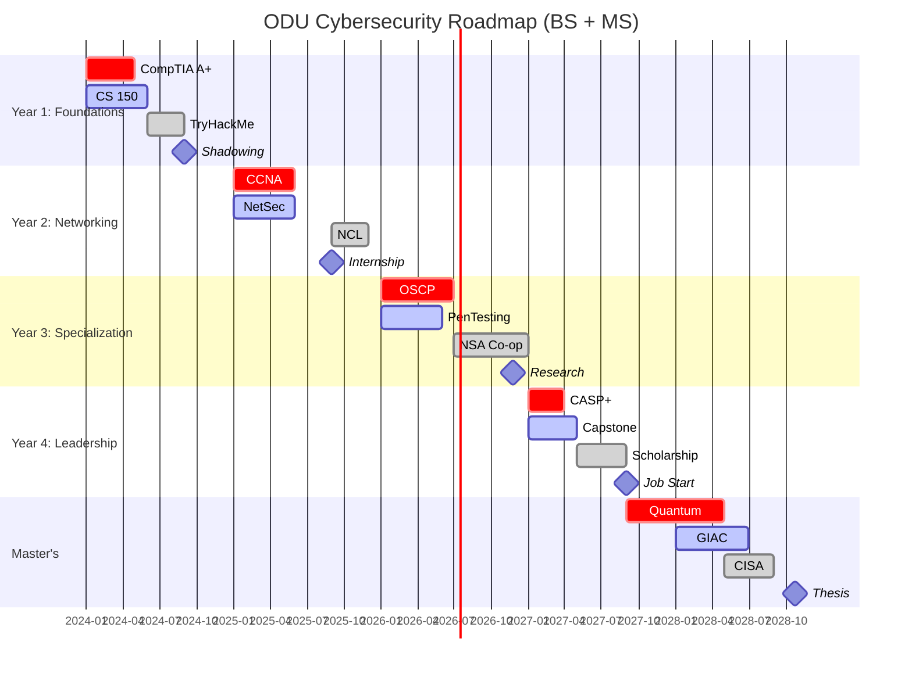

# Basic Cybersecurity Roadmap for ODU Students  
*Aligned with NIST NICE Framework, MITRE ATT&CK, & Top Global Programs*  

---

## **Global Best Practices Integration**  
- Follow [NIST NICE Framework](https://www.nist.gov/cyberframework) work roles (Protect & Defend, Analyze, Operate & Maintain).  
- Incorporate [MITRE ATT&CK](https://attack.mitre.org/) for real-world adversary behavior analysis.  
- Blend [Carnegie Mellon SEI CERT](https://www.cto.mil/dtea/sei_cmu/), [SANS Technology Institute](https://www.sans.edu/) , and [ETH Zurich methodologies](https://pp.ethz.ch/research/methodology.html)  

---

### **Year 1: Foundational Mastery**  
**Focus**: Core IT + Cybersecurity Basics  
- **Courses**:  
  - CS 150 (Cybersecurity Fundamentals)  
  - CS 252 (Secure Coding Principles)  
  - ENGN 110 (Hardware Security Basics) *[ODU Unique]*  
- **Certifications**:  
  - CompTIA ITF+ → **A+** (Global gold standard for IT fundamentals)  
  - eJPTv2 (Junior PenTest Cert by eLearnSecurity)  
- **Skills**:  
  - Linux CLI, Python scripting, Wireshark basics  
  - ODU Cyber Range: Practice in controlled environments  
- **Actionables**:  
  - Join **ODU CSA + Collegiate Cyber Defense Club**  
  - Complete **TryHackMe "Beginner Path"**  
  - Shadow ODU CISO team for campus security audits  

---

### **Year 2: Technical Depth + Networking**  
**Focus**: Network Security, Threat Intelligence  
- **Courses**:  
  - CS 351 (Advanced Network Security)  
  - CS 382 (Cloud Security Architecture) *[AWS/Azure Focus]*  
- **Certifications**:  
  - **CompTIA Security+** → **Cisco CyberOps Associate**  
  - Microsoft SC-900 (Security, Compliance, Identity)  
- **Skills**:  
  - SIEM tools (Splunk, ELK Stack)  
  - MITRE ATT&CK Navigator for threat mapping  
- **Actionables**:  
  - Compete in **National Cyber League (NCL) Individual Game**  
  - Intern at **Virginia Cyber Range** or **ODU CCER**  
  - Build a network lab with PfSense/OPNsense  

---

### **Year 3: Specialization + Operations**  
**Focus**: Choose Track (Offensive/Defensive/GRC)  
- **Tracks**:  
  - **Red Team**: CS 481 (Advanced PenTesting), OSCP Prep  
  - **Blue Team**: CS 472 (Incident Response), CISSP Domains  
  - **GRC**: CS 475 (Risk Mgmt), CISA Prep  
- **Certifications**:  
  - **OSCP** (Offensive Security) / **CySA+** (Defensive)  
  - **CISSP Associate** (ISC²) for GRC  
- **Actionables**:  
  - Join **ODU MITRE College Challenge** team  
  - Intern at **NSA Cybersecurity Directorate** (Co-op program)  
  - Publish in **ODU Undergraduate Research Journal**  

---

### **Year 4: Professional Transition**  
**Focus**: Enterprise Security + Leadership  
- **Courses**:  
  - CS 497 (Capstone: Simulated Cyber War Games)  
  - CS 491 (AI/ML in Cybersecurity) *[ODU AI Lab Access]*  
- **Certifications**:  
  - **CASP+** (Technical Leadership)  
  - AWS Certified Security Specialty / Azure SC-200  
- **Actionables**:  
  - Lead **ODU CCDC Team** (Collegiate Cyber Defense Competition)  
  - Apply for **DoD SMART Scholarship** (Full-ride + job guarantee)  
  - Attend **BSides Charm/Virginia** conferences  

---

### **Master’s Degree (MS in Cybersecurity)**  
**Global-Elite Alignment**:  
- **Research Tracks**:  
  - Quantum-Resistant Cryptography (ODU/NIST Partnership)  
  - Maritime Cybersecurity (Leverage ODU’s NATO Location)  
  - AI-Driven Threat Hunting (Collaborate with Virginia Modeling Center)  
- **Certifications**:  
  - **GIAC GSE** (Gold Standard for Technical Experts)  
  - **CISSP** (Full Credential)  
  - **CRISC** (Risk Mgmt for Leaders)  
- **Actionables**:  
  - Publish in **IEEE S&P** or **USENIX Security**  
  - Complete **SANS Graduate Certificate Program**  
  - Rotational internships: **MITRE** (Bedford), **CISA Joint Cyber Defense Collaborative**  

---

## **Global Cert Roadmap**  
| Level          | Certifications (Priority Order)       |  
|----------------|---------------------------------------|  
| Entry          | A+, Security+, eJPTv2                 |  
| Intermediate   | CySA+, OSCP, CCNA CyberOps            |  
| Advanced       | CISSP, GCIH, CISM                     |  
| Expert         | GIAC GSE, OSCE3, CRTSA                |  

---

## **ODU-Specific Opportunities**  
1. **NSA/DHS CAE-CD Designation**: Access to classified briefings.  
2. **DoD Cyber Scholarship Program**: Full tuition + stipend for service commitment.  
3. **Cyber Range**: Only university in Virginia with a Tier III facility.  
4. **Lockheed Martin Cyber Alliance**: Direct pipeline for internships.  

---

## **Timeline Visualization**  

### 🎨 Color Legend

| Element Type   | Color       | Mermaid Code | Example          |
|----------------|-------------|--------------|------------------|
| Certifications | 🔴 Red      | `:crit,`     | CompTIA A+       |
| Courses        | 🔵 Blue     | `:active,`   | CS 150           |
| Experiences    | 🟢 Green    | `:done,`     | TryHackMe        |
| Milestones     | ⬥ Diamond   | `:milestone` | Internship       |
